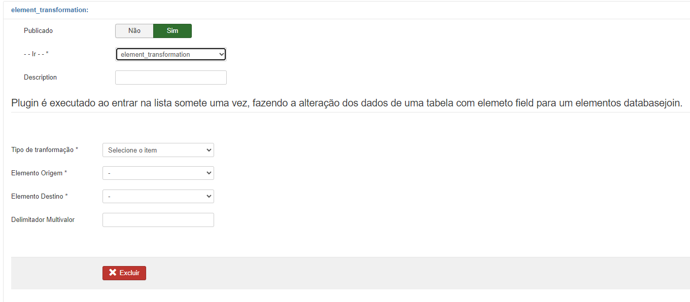
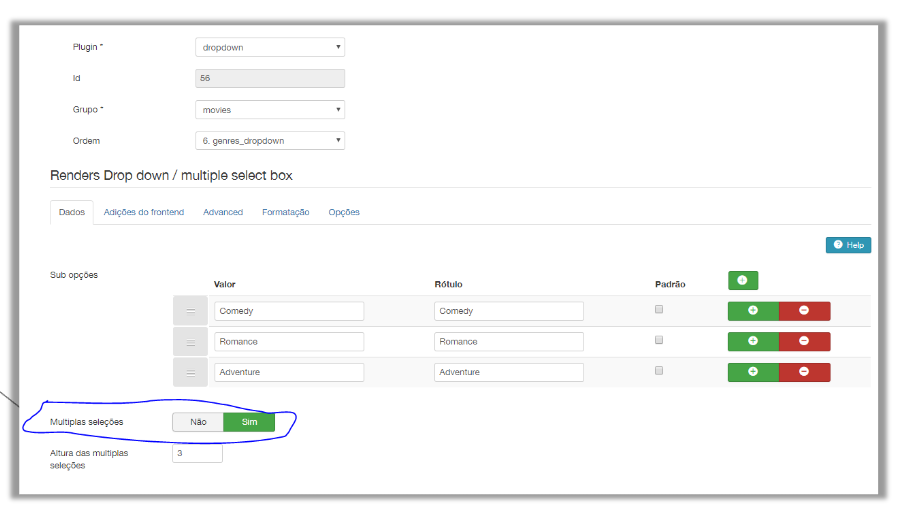
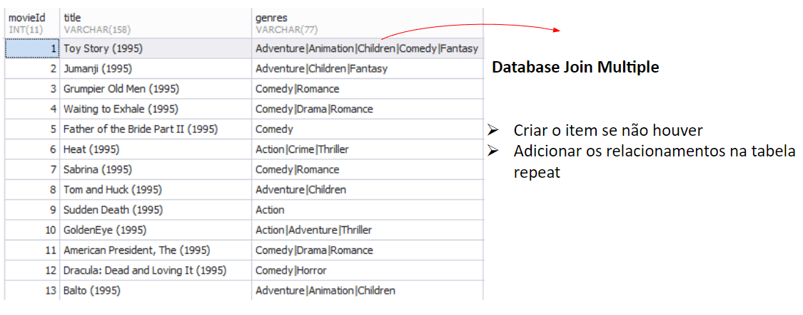
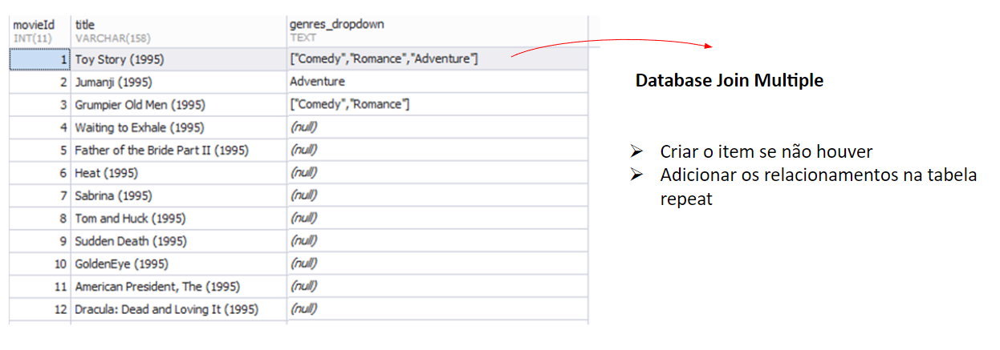

# Element Transformation

  

## Sobre

É um plugin de lista utilizado para transformar elementos de uma coleção.

São 2 os tipos de transformações de elementos:

- Transformar elemento do tipo field para elemento do tipo radiobutton ou dropdown – <b>Field para Dropdown.</b>

- Transformar elemento do tipo dados para um elemento de relacionamento (com ou sem sincronismo de dados) – <b>Field/Dropdown/etc  para Databasejoin</b>

## Especificações

Dentre os tipos de transfomações existem 4 possibilidades:

### 1. String para Databasejoin 1-N ou NN:

 Nesta transformação o usuário deve selecionar a Transformation Type "String to DatabaseJoin".

  

- O admin deve escolher o elemento do tipo field ou dropdown ou radiobutton ou checkbox ou qualquer elemento que contenha uma string armanezada no campo da tabela.

- O admin deve previamente criar um relacionamento da lista origem com a lista vinculada, exemplo: Cliente <> Cidade.

 - O algoritmo deve pegar o valor da string do campo cidade na lista origem, procurar essa string  na outra lista vinculada no campo definido pelo Label (configurado no databasejoin) , a partir do casamento das strings, descobrir o ID do item (cidadeXYZ) e depois armazenar o ID no novo campo de relacionamento que foi criado (_Cidade). 

 - Assim, o que era uma string em uma coluna vai virar um ID na nova coluna criada no BD. Depois do processo concluído o sistema deve automaticamente dar unpublish no elemento origem.

- Nota: se o relacionamento configurado no databasejoin for 1-N, o algoritmo deve usar a tabela auxiliar criada para armazenar os IDs 

- Ao habilitar o sincronizar, se caso o algoritmo tiver um registro na lista origem com uma string no elemento origem que não for encontrada na lista vinculada, o sistema cria um registro na lista vinculada, pega o novo ID e armazena.

 

### 2. String multivalue para Dropdown Multiple:

 Nesta transformação o usuário deve selecionar a Transformation Type "String Multivalue to Dropdown", após selecionar o Elemento Origem e Elemento Destino, o elemento tem seu tipo alterado na tabela interna do fabrik: é alterado de Field para DropDown. Todos os valores diferentes encontrados na tabela para esse campo, são armazenados em json como opções do elemento dropdown. Assim, se tem o nome de estados nesse campo, cada estado é adicionado automaticametne como uma opção no dropdown do elemento convertido.

  

Logo após a transformação o admin deve acessar o elemento transformado e selecionar a opção multiplas seleções.

### 3. String multivalue para DatabaseJoin Multiple

 Nesta transformação o usuário deve selecionar a Transformation Type "String Multivalue to DatabaseJoin", após selecionar o Elemento Origem e Elemento Destino o algoritmo converte uma string com múltiplos valores separados por | em relacionamentos do elemento databasejoin (drop ou multi).

Exemplo do resultado no banco de dados:

 

  

 

### 4. DropDown multivalue para DatabaseJoin Multiple

 Nesta transformação o usuário deve selecionar a Transformation Type "Dropdown Multivalue to DatabaseJoin", após selecionar o Elemento Origem e Elemento Destino o algoritmo converte um elemento dropdown (array) em relacionamentos do elemento databasejoin multilist.

Exemplo do resultado no banco de dados:

 

  

